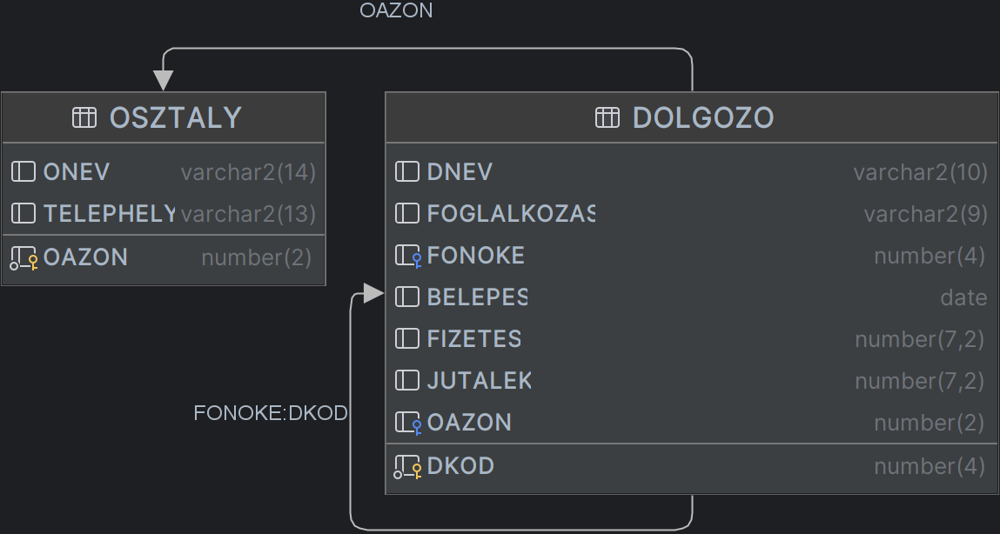

# 03. Összekapcsolások
Lehetőségünk van táblák összekapcsolására.

Tekintsük a következő táblákat:



## 1. Természetes összekapcsolás

Eredménye a két tábla, azon sorainak összevonása, melyekben az azonos nevű oszlopokban szereplő érétkek megegyeznek.
```sql
SELECT * FROM dolgozo NATURAL JOIN osztaly
```
Az összekapcsolás az `OAZON` mező alaphán történik, az eredmény így a következő lesz (részlet):

<div class='table'>

| OAZON | DKOD | DNEV | FOGLALKOZAS | FONOKE | BELEPES | FIZETES | JUTALEK | ONEV | TELEPHELY |
| :--- | :--- | :--- | :--- | :--- | :--- | :--- | :--- | :--- | :--- |
| 10 | 7782 | CLARK | MANAGER | 7839 | 1981-06-09 | 2450.00 | null | ACCOUNTING | NEW YORK |

</div>

Ha nincs azonos nevű oszlopoknak más a típusa hibával tér vissza.

## 2. Using
A `USING` záradékkal lehetőségünk van explicit megadni, mely oszlop egyenlősége alapján történjen a természetes összekapcsolás.
```sql
SELECT * FROM dolgozo JOIN osztaly USING (oazon)
```

## 3. On
Az `ON` záradékkal lehetőségünk van valamilyen feltételhez kötni az összekapcsolást.
```sql
SELECT * FROM dolgozo d JOIN osztaly o ON d.oazon = o.oazon;
```

## 4. Külső összekapcsolás (`OUTER JOIN`)
Lehetőségünk van arra, hogy két táblát úgy kapcsoljunk össze, hogy az ereményhez hozzá vesszük a baloldali, a jobboldali vagy esetleg mindkét tábla összes sorát.

### Bal oldali:
```sql
SELECT * FROM dolgozo d LEFT OUTER JOIN osztaly o ON d.oazon = o.oazon;
```
Ez azt eredményezi hogy az eredményben azok a dolgozók is megjelennek akik nincsenek osztályhoz rendelve.

<div class='table'>

| DKOD | DNEV | FOGLALKOZAS | FONOKE | BELEPES | FIZETES | JUTALEK | OAZON | OAZON | ONEV | TELEPHELY |
| :--- | :--- | :--- | :--- | :--- | :--- | :--- | :--- | :--- | :--- | :--- |
| 7877 | LOLA | CLERK | 7902 | 1981-01-12 | 800.00 | null | null | null | null | null |

</div>

### Jobb oldali:
```sql
SELECT * FROM dolgozo d RIGHT OUTER JOIN osztaly o ON d.oazon = o.oazon;
```
Ez azt eredményezi hogy az eredményben azok az osztályok is megjelennek, melyeken nem dolgozik senki.
<div class='table'>

| DKOD | DNEV | FOGLALKOZAS | FONOKE | BELEPES | FIZETES | JUTALEK | OAZON | OAZON | ONEV | TELEPHELY |
| :--- | :--- | :--- | :--- | :--- | :--- | :--- | :--- | :--- | :--- | :--- |
| null | null | null | null | null | null | null | null | 40 | OPERATIONS | BOSTON |

</div>

### Teljes összekapcsolás:
```sql
SELECT * FROM dolgozo d FULL OUTER JOIN osztaly o ON d.oazon = o.oazon;
```
Az eredményben az osztályhoz nem rendelt dolgozók és a dolgozó nélküli osztályok is megjelennek.

## 5. Descartes-szorzat (keresztszorzat)
```sql
SELECT * FROM dolgozo CROSS JOIN osztaly;
```

## Feladatok

1. Adjuk meg azokat a telephelyeket ahol dolgozik `'ANALYST'` foglalkozású dolgozó!
2. Adjuk meg azokat a telephelyeket ahol **nem** dolgozik `'ANALYST'` foglalkozású dolgozó!
3. Adjuk meg king összes beosztottját!
4. (+/-) Hozz létre egy táblát GYAK3 néven, amely azokat a (beosztott, főnök) neveket tartalmazza, ahol a főnök legalább kétszer többet keres, mint a beosztottja.

## Megoldások
1.
    ```sql
    SELECT DISTINCT telephely
    FROM osztaly NATURAL JOIN dolgozo
    WHERE dolgozo.foglalkozas = 'ANALYST';
    ```
2.
    ```sql
    SELECT telephely
    FROM osztaly MINUS (
      SELECT DISTINCT telephely
      FROM osztaly NATURAL JOIN dolgozo
      WHERE dolgozo.foglalkozas = 'ANALYST'
    );
    ```
3.
    ```sql
    SELECT d.dnev
    FROM dolgozo d JOIN dolgozo f ON d.fonoke = f.dkod
    WHERE f.dnev = 'KING';
    ```
4.
    ```sql
    CREATE table GYAK3 AS
    SELECT d.dnev AS Dolgozó, f.dnev AS Főnök
    FROM dolgozo d JOIN dolgozo f ON d.fonoke = f.dkod
    WHERE f.fizetes >= d.fizetes * 2;
    ```
