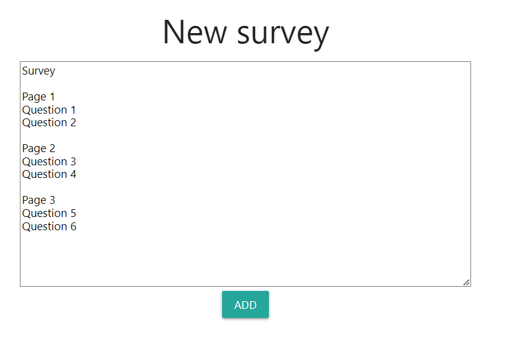

# Kérdőívek

_Kliensoldali webprogramozás 2. beadandó_

## Nyilatkozat

Kérlek, töltsétek ki az adataitokkal beadás előtt!

```txt
Boda Bálint
KDHPNI
Kliensoldali webprogramozás - beadandó
Ezt a megoldást a fent írt hallgató küldte be és készítette a Kliensoldali webprogramozás kurzus számonkéréséhez.
Kijelentem, hogy ez a megoldás a saját munkám. Nem másoltam vagy használtam harmadik féltől
származó megoldásokat. Nem továbbítottam megoldást hallgatótársaimnak, és nem is tettem közzé.
Az Eötvös Loránd Tudományegyetem Hallgatói Követelményrendszere
(ELTE szervezeti és működési szabályzata, II. Kötet, 74/C. §) kimondja, hogy mindaddig,
amíg egy hallgató egy másik hallgató munkáját - vagy legalábbis annak jelentős részét -
saját munkájaként mutatja be, az fegyelmi vétségnek számít.
A fegyelmi vétség legsúlyosabb következménye a hallgató elbocsátása az egyetemről.
```

## A feladat

A beadandóban olyan webes alkalmazást kell írnod, amelyben egy felhasználónak lehetősége van többlépéses kérdőíveket összeállítania. Az elkészített kérdőíveket egy táblázatban át lehet tekinteni, ahol lehetőség van ezek módosítására, törlésére, valamint azok megosztására egy linken keresztül. Ezen a linken keresztül aztán a kérdőívet ki lehet tölteni. A kérdőívekhez tartozó válaszokat ezt követően egy külön felületen meg lehet tekinteni. 

A feladatot _React_ és _Redux_ kombinációjával kell megoldanod, Redux esetében ajánlott a _redux toolkit_ és akár az _RTK Query_ használata. Mivel az alkalmazás több oldalból áll, a _react-router_ használata javasolt.
A feladatban adott a szerveroldali REST API, leírását lentebb olvashatjátok, ehhez kell igazodnia a kliensnek.

## Oldalak

### Navigáció

Minden oldal tetején megjelenik egy navigációs sáv, ahol az alkalmazás neve és az elérhető funkciók vannak menüpontokban megjelenítve:

- Kérdőívek (ez az alkalmazás neve, rákattintva főoldalra visz)
- Ha nincs bejelentkezve
  - Regisztráció
  - Bejelentkezés
- Bejelentkezve
  - Kérdőíveim
  - Válaszok
  - Profil
  - Kijelentkezés

### Főoldal

Statikus információkat tartalmazó oldal, az alkalmazás címével és egy rövid leírással.

### Regisztráció

Az alábbi adatok megadása szükséges:

- teljes név (kötelező)
- email cím (email, kötelező)
- jelszó (kötelező)

Validáció elegendő HTML5 attribútumokkal!

### Bejelentkezés

Az alábbi kötelező adatokkal történik:

- email (email. kötelező)
- jelszó (kötelező)

Validáció elegendő HTML5 attribútumokkal!

### Új kérdőív

Csak bejelentkezve érhető el.
Egy darab textarea-t tartalmaz, amin keresztül újabb kérdőívet készíthetünk.
A kérdőív egy "kód" formájában készül, aminek szabályai a következőek:

- első sor tartalmazza a kérdőív megnevezését
- minden kérdőíven belüli lap egy üres sorral kezdődik
- a lapok első sora tartalmazza annak a megnevezését, majd alatta külön sorokban az egyes kérdések

A bevitt adatot ellenőrizni kell. A formátum ellenőrzésekor elég a következőket figyelni:
- nem üres,
- van címe,
- legalább 1 lapja,
- laponként legalább 1 kérdéssel.

A kérdések minden esetben egyszerű szöveges választ várnak. 

A kérdőív mentésekor a REST API automatikusan a bejelentezettt felhasználóhoz rendeli a kérdőívet, generál neki egy egyedi azonosítót (`hash`), amit majd a hivatkozáshoz lehet használni.



### Kérdőíveim

Csak bejelentkezve érhető el.
A bejelentkezett felhasználóhoz tartozó kérdőívek jelennek itt meg, minden feladatsornál azok nevei, létrehozási dátumai és a hozzá tartozó funkciógombok. A nevek linkek, amik a  kérdőívhez tartozó linkre (`hash`) mutatnak (ezen keresztül van lehetőség annak kitöltésére). Minden kérdőívnél lehetőség van:

- annak törlésére,
- módosítására (az "Új kérdőív" felületen jelenik meg a jelenlegi kérdőív "kódja"),
- hozzá tartozó link vágólapra másolására,
- valamint a hozzá tartozó válaszok megtekintésére.


### Kérdőív

Az előző részben tárgyalt hivatkozás ismeretében bárki elérheti. Pl. `http://localhost:3000/survey/<hash>`.

A kérdőív különböző lépésekként jeleníti meg az egyes lapokon található kérdéseket. A következő lapra csak abban az esetben léphetünk, ha a felhasználó már minden aktuális mezőt kitöltött. Navigálni az előre-hátra gombokkal, illetve a lapok neveire kattintva lehet. Lapra csak akkor lehet lépni, ha már ki van töltve, vagy éppen az az aktuális.

A legvégén a beküldés gomb hatására a válaszokat felküldjük. Csak úgy küldhető be a kérdőív, ha minden adat ki van töltve.


### Válaszok

Csak bejelentkezve érhető el.
A "Kérdőíveim" oldalon kiválasztott kérdőív válaszai tekinthetőek itt meg listaszerűen. Megjelenik a kérdőív címe, a kérdések és a kérdések alatt a kitöltők által adott válaszok.


### Profil

Csak bejelentkezve érhető el.
A bejelentkezett felhasználó adatai jelennek meg.

- Név
- Email
- Kérdőívek száma
- Kijelentkezés gomb

## A kliens

Az alkalmazást a `client` mappában kell elkészíteni. A mappa egyelőre egy teljesen friss Vite telepítést tartalmaz, a szükséges további függőségeket Nektek kell hozzáadni. A nem szükséges dolgokat viszont nyugodtan ki is törölheted!

```
cd client
npm install
npm run dev
```

## REST API

A szerver forráskódja a `rest-api` mappában található. Telepíteni és indítani kell lokálisan:

```
cd rest-api
npm install
npm start
```

Három szolgáltatás van kivezetve:

- `users`
- `surveys`
- `results`

A végpontok leírását és kipróbálását úgy tehetitek meg legegyszerűbben, ha az alábbi Postman gyűjteményeket importáljátok a Postman REST API kliensbe. Ez egy webes alkalmazás, a Postman Agentet lokálisan telepíteni kell, majd a megnyíló alkalmazásban egy új Workspace-t kell létrehozni, és fent megnyomni az "Import" gombot, és egyesével linkként beilleszteni őket:

- [auth gyűjtemény](https://api.postman.com/collections/15151253-4cf57ab5-49d7-4350-af18-9e3c7b29626a?access_key=PMAT-01H0JMHKRYB30J9BFQAMQ2PDR2)
- [surveys gyűjtemény](https://api.postman.com/collections/15151253-faa17ed9-b3d4-4e85-b681-52fe8dbfde37?access_key=PMAT-01H0JMK0RGT8BH9CQY6CGF8ZW6)
- [results gyűjtemény](https://api.postman.com/collections/15151253-b3e753b2-42d0-4946-b312-999bb75002d4?access_key=PMAT-01H0JMKX3741T69NKZXD9ABX6Z)

Innentől kipróbálhatók a végpontok. A felküldendő tartalmak a Body részben vannak előkészítve. 

A `surveys` és `results` végpontok eléréséhez hitelesítés szükséges. Ehhez egy `Authorization` HTTP fejlécet kell küldeni `Bearer token` tartalommal. A tokent a login végpont adja vissza. Az authentikációhoz tartozó JWT token a `surveys` és `results` gyűjtemény `Authorization` fülén van elmentve, ott igény szerint cserélhető. Az itt megadott token is használható próbaképpen, de az alkalmazásban dinamikusan kell generáltatni.

## Adatbázis

A mentett adatok egy lokális SQLite táblában jelennek meg: `rest-api.sqlite`. Ezt pl. a [DB Browser for SQLite](https://sqlitebrowser.org/) programmal tudunk megnézni, módosítani.

## További információk

Elvárás az igényes megjelenés. Ehhez használhatsz saját CSS-t is, de komponens függvénykönyvárakat is, mint pl. [Material UI](https://mui.com/) vagy [Bootstrap](https://react-bootstrap.github.io/).

## Feltöltendő

Az egész projektet tömörítsd be, kliensestül, szerverestül, és azt töltsd föl. **Beadás (tömörítés) előtt a `node_modules` mappákat mindenképpen töröld!**

## Pontozás

Összesen 30 pont érhető el.

- [x] React használata (kötelező)
- [x] Redux használata (kötelező)
- [x] Navigáció megfelelően változik a be- és kijelentkezésnek megfelelően (1pt)
- [x] Főoldal megjelenik (1pt)
- [x] Regisztráció működik (1pt)
- [x] Bejelentkezés működik (1pt)
- [x] Új kérdőív, Kérdőíveim: csak bejelentkezve érhetőek el (1pt)
- [x] Új kérdőív: új kérdőív mentésének helyes működése (2pt)
- [x] Kérdőíveim: megjelennek a kérdőívek az elérhető funkciókkal (2pt)
- [ ] Kérdőíveim: módosítás helyes működése (2pt)
- [x] Kérdőíveim: törlés helyes működése (2pt)
- [x] Kérdőíveim: hivatkozás helyes működése (1pt)
- [x] Kérdőív: a kérdőív kérdései megjelennek (3pt)
- [x] Kérdőív: a kérdések lapozható formában jelennek meg a lapok megnevezéseivel, a lapok közötti navigáció megfelelő (2pt)
- [x] Kérdőív: csak kitöltött oldal esetén lehet továbblapozni (1pt)
- [x] Kérdőív: lapozón vizuálisan látszik, hogy mely lapnál tartunk (1pt)
- [x] Kérdőív: beküldés helyes működése (2pt)
- [x] Válaszok: a kiválasztott kérdőívre adott válaszok megjelennek (2pt)
- [x] Profil: csak bejelentkezve érhető el, megfelelő tartalommal (2pt)
- [x] Profil: Kijelentkezés gomb működik (1pt)
- [x] Igényes megjelenés (2pt)
- [ ] Pluszok: a kérdőíveim lista lapozható (pl. 5-ösével) (+2pt)
- [ ] Pluszok: a válaszok lista lapozható (pl. 10-esével) (+2pt)
- [x] Pluszok: a kérdőív linkje egy gombra kattintva a vágólapra másolható (+1pt)
- [ ] 1 hét késés (-3pt)
- [ ] 2 hét késés (-6pt)
